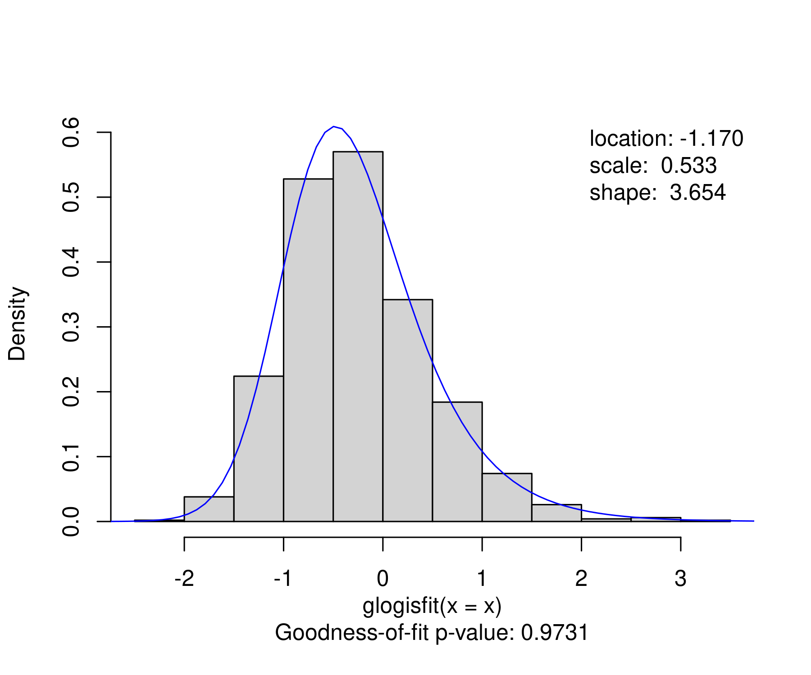

<!-- README.md is generated from README.qmd via: quarto render README.qmd --to gfm -->

# Fitting and Testing Generalized Logistic Distributions in R

## Overview

The R package [glogis](https://zeileis.codeberg.page/glogis/) provides:

- Density `dglogis`, distribution function `pglogis`, quantile function
  `qglogis`, and random generation `rglogis` for the type-I
  (skew-logistic) generalized logistic distribution.

- Fitting univariate type-I generalized logistic distributions with
  location, scale, and shape parameters via `glogisfit`.

- Interface to
  [strucchange](https://doi.org/10.32614/CRAN.package.strucchange) for
  fitting segmented type-I generalized logistic distributions to time
  series data.

## Reference

Windberger T, Zeileis A (2014). “Structural Breaks in Inflation Dynamics
within the European Monetary Union.” *Eastern European Economics*,
**52**(3), 66-88.
[doi:10.2753/EEE0012-8775520304](https://doi.org/10.2753/EEE0012-8775520304)

## Installation

The stable version of `glogis` is available from
[CRAN](https://CRAN.R-project.org/package=glogis):

``` r
install.packages("glogis")
```

The latest development version can be installed from
[R-universe](https://zeileis.R-universe.dev/glogis):

``` r
install.packages("glogis", repos = "https://zeileis.R-universe.dev")
```

## License

The package is available under the [General Public License version
3](https://www.gnu.org/licenses/gpl-3.0.html) or [version
2](https://www.gnu.org/licenses/old-licenses/gpl-2.0.html)

## Get started

Simulation of a simple artificial sample from a generalized logistic
distribution.

``` r
library("glogis")
set.seed(2)
x <- rglogis(1000, location = -1, scale = 0.5, shape = 3)
```

Fitting the distribution via maximum likelihood.

``` r
gf <- glogisfit(x)
plot(gf)
```



``` r
summary(gf)
## 
## Call:
## glogisfit(x = x)
## 
## 
## Coefficients:
##            Estimate Std. Error z value Pr(>|z|)    
## location   -1.16961    0.18840  -6.208 5.36e-10 ***
## log(scale) -0.63017    0.04323 -14.578  < 2e-16 ***
## log(shape)  1.29581    0.25916   5.000 5.73e-07 ***
## ---
## Signif. codes:  0 '***' 0.001 '**' 0.01 '*' 0.05 '.' 0.1 ' ' 1
## 
## Log-likelihood: -1074 on 12 Df
## Goodness-of-fit statistic: 39.11 on 58 DF,  p-value: 0.9731
## Number of iterations in BFGS optimization: 15
```

Querying parameters and associated moments.

``` r
coef(gf)
##   location log(scale) log(shape) 
## -1.1696110 -0.6301687  1.2958079
coef(gf, log = FALSE)
##   location      scale      shape 
## -1.1696110  0.5325019  3.6539469
gf$parameters
##   location      scale      shape 
## -1.1696110  0.5325019  3.6539469
gf$moments
##       mean   variance   skewness 
## -0.2483885  0.5556121  0.8407388
```
